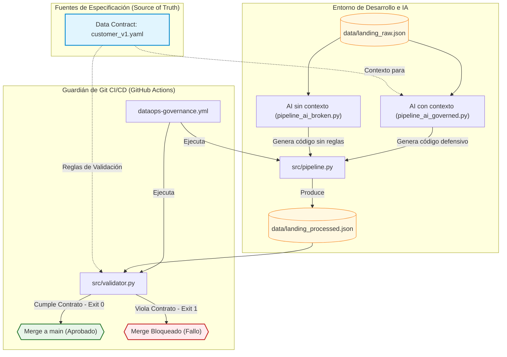
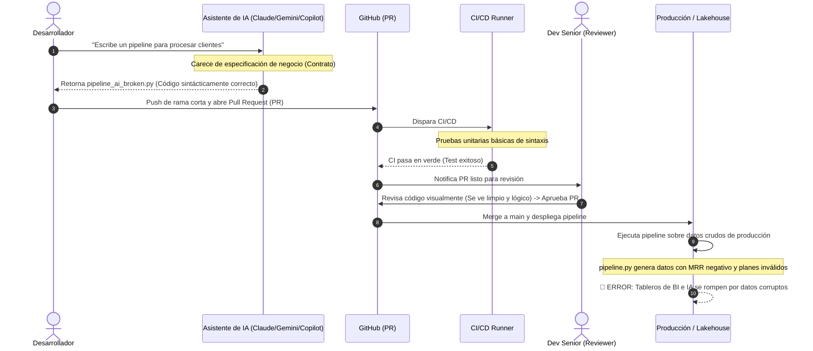
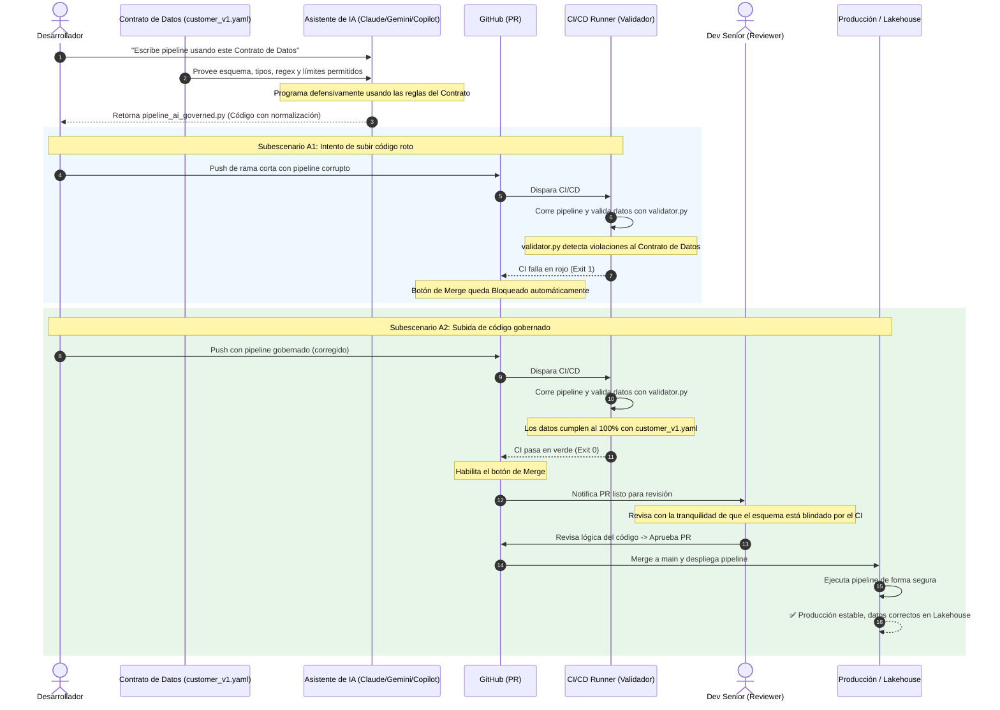

# 📚 Demo de Gobernanza de IA con Data Contracts
### Curso: Contract-Driven DataOps con Git e IA

Esta guía está diseñada para que el instructor realice una **demostración interactiva en vivo (Live Demo)** sobre cómo un esquema de gobernanza basado en **Git** y **Data Contracts** (Contratos de Datos) actúa como un escudo protector cuando delegamos la creación de pipelines a **Agentes de IA** (como Cursor, Copilot o Devin).

---

## 🎯 Objetivos de Aprendizaje
Al finalizar esta demostración, los alumnos comprenderán:
1. **El peligro de la IA sin control:** Cómo los copilotos pueden generar código sintácticamente correcto pero que viola reglas de negocio silenciosamente.
2. **El paradigma Contract-First:** Cómo el contrato de datos en YAML sirve de "especificación de verdad" tanto para los humanos como para la IA.
3. **El rol del CI/CD de Git:** Cómo Git se convierte en el guardián definitivo que bloquea integraciones defectuosas de código generado por IA antes de que toquen producción.

---

## 🗺️ Diagrama de Arquitectura y Flujo

El siguiente diagrama de Mermaid muestra cómo fluye la especificación del contrato de datos a través de las fases de desarrollo (guiadas por IA), generación del pipeline y validación defensiva en el CI/CD antes de permitir el merge a producción:



---

## 🔄 Diagramas de Secuencia: Flujo de Trabajo (Caos vs. Gobierno)

Para comprender mejor cómo interactúan el desarrollador (asistido por IA), GitHub, el CI/CD, el Dev Senior y el Lakehouse, a continuación se presentan los diagramas de secuencia para ambos escenarios.

### Escenario A: Flujo Tradicional sin Gobierno (El Caos)
En este flujo, al no haber una validación automatizada contra un contrato de datos en el CI/CD, el código generado por IA con errores silenciosos de lógica es aprobado y llega a producción, rompiendo los tableros analíticos.



---

### Escenario B: Flujo Spec-Driven con Gobierno (DataOps Seguro)
En este flujo, el Contrato de Datos es consumido por la IA para escribir código defensivo. Si el desarrollador o la IA intentan subir un pipeline incorrecto, el CI/CD ejecuta la validación dinámica del validador y bloquea automáticamente el Pull Request. Cuando se sube la solución conforme al contrato, el CI/CD aprueba y el Dev Senior puede realizar el merge con total tranquilidad.



---

## 🛠️ Estructura del Sandbox

El sandbox del repositorio simula un entorno de producción real:
```markdown
.github/workflows/
└── dataops-governance.yml   # Guardián del PR en GitHub Actions
contracts/
└── customer_v1.yaml         # El Contrato de Datos (la fuente de verdad)
data/
├── landing_raw.json         # Datos crudos de origen (ingesta)
└── landing_processed.json   # Datos procesados por el pipeline (output)
src/
├── validator.py             # Validador oficial del contrato
├── pipeline_ai_broken.py    # Simulación: Pipeline generado por IA sin contexto
└── pipeline_ai_governed.py  # Simulación: Pipeline generado por IA con contexto
```

---

## 🚀 Preparación del Entorno (15 minutos antes de la clase)

1. Asegúrate de tener instalado PyYAML en el entorno de Python:
   ```bash
   pip install pyyaml
   ```
2. Posiciónate en la terminal en la carpeta raíz de este repositorio.

---

## 🎭 La Demostración en 3 Actos

> **Prerrequisito:** Antes de iniciar, asegúrate de estar en la rama `develop` con el repositorio limpio (sin `src/pipeline.py` existente). Verifica que tu repositorio en GitHub tenga configurada la **protección de rama** en `main` con la regla *"Require status checks to pass before merging"* para el check `dataops-audit`.

Significa que nadie puede fusionar (hacer merge) código a la rama main a menos que el análisis o prueba llamado dataops-audit haya terminado con éxito.

## ¿Cómo funciona en la práctica?

* 🔒 Bloqueo automático: Cuando abres un Pull Request (PR) hacia main, el botón de Merge aparecerá en color gris y mostrará el mensaje "Merging is blocked".
* ⚙️ Ejecución del check: El sistema iniciará automáticamente la validación de dataops-audit (que suele auditar datos, esquemas o gobernanza) y en la parte inferior del PR, verás una lista de verificaciones. Allí aparecerá dataops-audit con un icono de reloj amarillo (en progreso), un check verde (aprobado) o una cruz roja (fallido).
* ✅ Resultado exitoso: Si el check termina en verde (aprobado), el bloqueo se quita y se permite la fusión.
* ❌ Resultado fallido: Si el check falla (rojo), nadie podrá integrar ese código a main hasta que se arreglen los errores.

## ¿Por qué se usa?

* Evita errores: Impide que subas cambios que rompan las bases de datos o los flujos de información.
* Automatiza la gobernanza: Garantiza que cada cambio de datos cumpla con las normas de auditoría de tu equipo sin depender de una revisión humana visual.

---

### Acto 1: La IA sin Control — Push, Fallo del CI y PR Bloqueado 🚫

> **Objetivo narrativo:** Demostrar que un pipeline generado por IA sin contexto de negocio pasa todas las pruebas de sintaxis, pero el CI/CD con validación de contrato lo **bloquea antes de llegar a producción**.

#### 💻 Paso 1 — Verificación local del desastre

1. Crea una **rama corta** (short-lived branch) desde `develop`:
   ```bash
   git checkout develop
   git checkout -b feat/ai-pipeline
   ```

2. Simula que la IA genera el pipeline **sin contexto del contrato**:
   ```bash
   cp src/pipeline_ai_broken.py src/pipeline.py
   ```

   Podriamos pedirle a la IA que cree el file tambien con el siguente prompt 
   
   ```yaml
   Tengo un archivo JSON en data/landing_raw.json con datos crudos de clientes que contiene los campos: id, signup, plan, mrr.

   Escribe un script en Python llamado src/pipeline.py que:
   1. Lea el archivo data/landing_raw.json
   2. Transforme cada registro a un formato limpio con estos campos:
      - customer_id: prefijo "usr-" + el id
      - signup_timestamp: la fecha de signup
      - subscription_plan: el plan en minúsculas
      - mrr_value: el valor de mrr como float
   3. Guarde el resultado en data/landing_processed.json
   ```
### 🎯 ¿Por qué funciona este prompt para la demo?

| Aspecto | Efecto |
|---|---|
| **No menciona el contrato YAML** | La IA no sabe que existen `allowed_values` (`free`, `premium`, `enterprise`) ni un `min_value: 0.0` |
| **Dice "en minúsculas"** | La IA hará `.lower()`, lo cual convierte `"basic"` → `"basic"` (un valor que **no existe** en el contrato) en lugar de mapearlo a `"free"` |
| **Dice "como float"** | La IA hará `float(mrr)` directo, pasando el `-15.0` sin validar que el contrato exige `min_value: 0.0` |
| **El código generado funcionará sin errores** | Esto es exactamente lo que quieres demostrar: código sintácticamente correcto pero **semánticamente incorrecto** |

3. Ejecuta el pipeline localmente para mostrar que **funciona sin errores**:
   ```bash
   python src/pipeline.py
   ```
   *Salida esperada:*
   ```text
   🚀 Iniciando procesamiento del pipeline (AI Ungoverned)...
   ✅ Pipeline finalizado. Resultados guardados en: .../data/landing_processed.json
   ```
   > 💬 *"Miren: la IA generó código que corre perfecto. Cero errores. Un desarrollador junior lo aprobaría sin dudar."*

4. **El momento de la verdad** — Corre el validador contra el contrato:
   ```bash
   python src/validator.py data/landing_processed.json
   ```
   *Salida esperada:*
   ```text
   🚨 INCUMPLIMIENTO DE CONTRATO DETECTADO EN: data/landing_processed.json
      - Fila 2: 'subscription_plan' tiene un valor no permitido. Recibido: 'basic'
      - Fila 3: 'mrr_value' viola el mínimo de 0.0. Recibido: -15.0
   ```
   > 💬 *"Los datos están corruptos. El plan 'basic' no existe en nuestro negocio y hay un MRR negativo. Si esto llega a producción, rompe los tableros de BI."*

#### 🚀 Paso 2 — Push a GitHub y apertura del Pull Request

5. Agrega los cambios, haz commit y push de la rama:
   ```bash
   git add src/pipeline.py
   git commit -m "feat: add AI-generated customer pipeline"
   git push origin feat/ai-pipeline
   ```

6. **Abre un Pull Request en GitHub** apuntando a `main`:
   - Ve a tu repositorio en GitHub
   - Haz clic en **"Compare & pull request"** (aparece automáticamente tras el push)
   - Título sugerido: `feat: add AI-generated customer pipeline`
   - Haz clic en **"Create pull request"**

#### 🔴 Paso 3 — Observar el fallo del CI y el bloqueo del merge

7. **Muestra la pestaña "Actions"** en GitHub:
   - El workflow `Spec-Driven DataOps Governance` se dispara automáticamente
   - Haz clic en el workflow en ejecución para ver los logs en tiempo real
   - El step **"Validar salida contra el contrato de datos"** fallará con `exit code 1`
   - El workflow completo se marca en **🔴 ROJO**

8. **Regresa al Pull Request** y muestra:
   - El check `dataops-audit` aparece como ❌ **failing**
   - El botón **"Merge pull request"** está **bloqueado/gris** (si configuraste branch protection)
   - Mensaje: *"All checks have failed — 1 failing check"*

> 💬 *"Producción a salvo. Git actuó como guardián automático. Ni el desarrollador ni un reviewer humano tuvieron que detectar el error — el contrato de datos lo hizo por ellos."*

#### 📌 Conclusión del Acto 1
El pipeline de la IA era sintácticamente perfecto pero violaba reglas de negocio. El CI/CD, alimentado por el contrato de datos, detectó las violaciones y **bloqueó automáticamente el PR**, impidiendo que datos corruptos lleguen al Lakehouse.

> ⚠️ **No hagas merge ni cierres el PR.** Lo usaremos en el Acto 2.

---

### Acto 2: La IA Gobernada por el Contrato — Fix, Push y PR Aprobado ✅

> **Objetivo narrativo:** Demostrar que cuando la IA recibe el contrato de datos como contexto, genera código defensivo que pasa la validación del CI/CD y habilita el merge.

#### 💻 Paso 1 — Corrección local con el pipeline gobernado

1. podemos pedirle a la IA que cree el nuevo pipeline pero considerando el contexto complete con el contrato 

o podemos simularlo reemplazando el pipeline roto con el gobernado (en la misma rama `feat/ai-pipeline`):
   ```bash
   cp src/pipeline_ai_governed.py src/pipeline.py
   ```

para solicitarlo a la IA podriamos pedirle  que cree el file con el siguente prompt 
   
```yaml
"Necesito un script en Python (src/pipeline.py) que procese datos crudos de clientes desde data/landing_raw.json y genere data/landing_processed.json.

El output DEBE cumplir estrictamente con el siguiente Contrato de Datos (contracts/customer_v1.yaml):
   - Los datos crudos tienen los campos: id (int), signup (string), plan (string) y mrr (float). 
   - Algunos registros pueden tener planes inválidos (como 'basic') o MRR negativos.
Programa de forma DEFENSIVA: si un plan no está en los valores permitidos, mapéalo a 'free'. Si el MRR es negativo, ajústalo a 0.0. Imprime advertencias cuando normalices valores."
```

### ¿Por qué funciona la diferencia?

| Aspecto | Acto 1 (sin contrato) | Acto 2 (con contrato) |
|---|---|---|
| **Campos de salida** | Solo los nombra | Define tipos, regex y restricciones |
| **Valores permitidos** | No los menciona | `['free', 'premium', 'enterprise']` explícito |
| **Rangos numéricos** | No dice nada | `min_value: 0.0` explícito |
| **Manejo de errores** | Inexistente | Instrucciones de mapeo defensivo |
| **Fuente de verdad** | La intuición de la IA | El YAML del contrato |

El punto didáctico clave es: **el mismo modelo de IA produce código radicalmente diferente dependiendo del contexto que le das**. El contrato YAML actúa como un "system prompt de negocio" que ancla a la IA a las reglas reales.

---

2. Ejecuta el pipeline gobernado localmente:
   ```bash
   python src/pipeline.py
   ```
   *Salida esperada:*
   ```text
   🚀 Iniciando procesamiento del pipeline (AI Governed)...
   ⚠️ Plan 'basic' no permitido. Mapeando a 'free' según especificación.
   ⚠️ MRR negativo detectado (-15.0). Ajustando a 0.0 para cumplir el contrato.
   ✅ Pipeline finalizado. Resultados guardados en: .../data/landing_processed.json
   ```
   > 💬 *"Noten cómo la IA ahora normaliza los datos: mapea planes inválidos y corrige valores negativos. Esto es porque le dimos el contrato YAML como contexto."*

3. Valida localmente que los datos cumplen el contrato:
   ```bash
   python src/validator.py data/landing_processed.json
   ```
   *Salida esperada:*
   ```text
   ✅ data/landing_processed.json cumple 100% con la especificación 'customer_gold'.
   ```

#### 🚀 Paso 2 — Push de la corrección al mismo PR

4. Haz commit y push de la corrección sobre la **misma rama** (el PR existente se actualiza automáticamente):
   ```bash
   git add src/pipeline.py
   git commit -m "fix: use governed pipeline with contract-driven validation"
   git push origin feat/ai-pipeline
   ```

#### 🟢 Paso 3 — Observar el pase del CI y la habilitación del merge

5. **Regresa a GitHub** y observa:
   - En la pestaña **"Actions"**: el workflow se vuelve a disparar automáticamente con el nuevo push
   - El step **"Validar salida contra el contrato de datos"** ahora pasa con `exit code 0`
   - El workflow completo se marca en **🟢 VERDE**

6. **Regresa al Pull Request** y muestra:
   - El check `dataops-audit` aparece como ✅ **passing**
   - El botón **"Merge pull request"** ahora está **habilitado en verde**
   - Mensaje: *"All checks have passed — 1 successful check"*

7. **Realiza el merge** del PR haciendo clic en **"Merge pull request"** → **"Confirm merge"**:
   > 💬 *"Ahora sí: el código gobernado por el contrato pasó todas las validaciones. El Dev Senior puede aprobar con total tranquilidad porque el esquema está blindado por el CI."*

8. (Opcional) Después del merge, actualiza tu rama `develop` local:
   ```bash
   git checkout develop
   git pull origin main
   ```

#### 📌 Conclusión del Acto 2
La IA, guiada por el contrato de datos, generó código defensivo. El validador retornó `exit 0`, el CI pasó en verde y Git habilitó el merge. El Lakehouse recibe datos correctos y producción se mantiene estable.

---

### Acto 3: Evolución del Contrato — Nuevo Campo, Fallo y Recuperación 🔄

> **Objetivo narrativo:** Demostrar que cuando el negocio evoluciona (nuevos campos requeridos), el contrato se actualiza primero y el CI/CD bloquea automáticamente cualquier pipeline que no cumpla con la nueva especificación, hasta que se corrija.

#### 💻 Paso 1 — Evolución del contrato de datos

1. Crea una nueva rama para simular la evolución:
   ```bash
   git checkout develop
   git checkout -b feat/add-email-field
   ```

2. Edita el contrato `contracts/customer_v1.yaml` para añadir un **nuevo campo requerido**. Agrega estas líneas al final del archivo (dentro del bloque `fields`):
   ```yaml
     email:
       type: string
       required: true
       pattern: "^[a-zA-Z0-9._%+-]+@[a-zA-Z0-9.-]+\\.[a-zA-Z]{2,}$"
   ```

3. Verifica localmente que el pipeline actual **ya no cumple** el contrato actualizado:
   ```bash
   python src/pipeline.py
   python src/validator.py data/landing_processed.json
   ```
   *Salida esperada:*
   ```text
   🚨 INCUMPLIMIENTO DE CONTRATO DETECTADO EN: data/landing_processed.json
      - Fila 0: Campo requerido 'email' ausente.
      - Fila 1: Campo requerido 'email' ausente.
      - Fila 2: Campo requerido 'email' ausente.
      - Fila 3: Campo requerido 'email' ausente.
      - Fila 4: Campo requerido 'email' ausente.
   ```
   > 💬 *"El negocio exige ahora un campo 'email' validado con regex. El pipeline actual no lo genera. Sin el contrato, este cambio pasaría desapercibido."*

#### 🔴 Paso 2 — Push con el contrato actualizado (sin corregir el pipeline)

4. Haz commit y push **solo con el contrato actualizado** (el pipeline sigue sin generar el campo `email`):
   ```bash
   git add contracts/customer_v1.yaml src/pipeline.py
   git commit -m "feat: add required email field to data contract"
   git push origin feat/add-email-field
   ```

5. **Abre un Pull Request** en GitHub apuntando a `main` y observa:
   - El CI se dispara y **falla en 🔴 ROJO** porque los datos generados no incluyen `email`
   - El merge queda **bloqueado**

   > 💬 *"Intentamos subir el cambio del contrato sin actualizar el pipeline. El CI lo detectó inmediatamente."*

#### 🟢 Paso 3 — Corrección del pipeline y pase del CI

6. Pídele en vivo a tu asistente de IA (Claude/Gemini/Copilot) que corrija `src/pipeline.py` para cumplir el nuevo contrato, o simula la corrección editando el archivo manualmente. Agrega la generación del campo `email` en el diccionario `processed_record`:
   ```python
   # Dentro del bucle for, agregar al diccionario processed_record:
   "email": f"usr-{record['id']}@fintechpay.com"
   ```

7. Verifica localmente que ahora pasa:
   ```bash
   python src/pipeline.py
   python src/validator.py data/landing_processed.json
   ```
   *Salida esperada:*
   ```text
   ✅ data/landing_processed.json cumple 100% con la especificación 'customer_gold'.
   ```

8. Haz commit y push de la corrección:
   ```bash
   git add src/pipeline.py
   git commit -m "fix: generate email field to comply with updated contract"
   git push origin feat/add-email-field
   ```

9. **Regresa a GitHub** y observa:
   - El CI se vuelve a disparar y ahora pasa en **🟢 VERDE**
   - El botón de merge se **habilita**
   - Realiza el merge: **"Merge pull request"** → **"Confirm merge"**

   > 💬 *"El contrato evolucionó, el pipeline se adaptó, y el CI validó todo automáticamente. Este es el poder del Contract-Driven DataOps."*

#### 📌 Conclusión del Acto 3
Cuando el negocio evoluciona y el contrato de datos cambia, cualquier pipeline que no se adapte será bloqueado automáticamente por el CI/CD. La IA puede adaptar el código rápidamente basándose en los errores del validador y la nueva especificación YAML, cerrando el ciclo de gobernanza.

---

## 💡 Preguntas para Debatir con la Clase
* ¿Por qué es más eficiente validar en el CI/CD en lugar de validar únicamente cuando los datos ya entraron al Data Lake?
* Si un desarrollador junior o una IA decide cambiar un tipo de dato en la base de datos origen sin avisar, ¿cómo nos protege este flujo?
* ¿Qué rol juega Trunk-Based Development en permitir que el código corregido por la IA llegue rápido a producción sin crear conflictos de merge?
