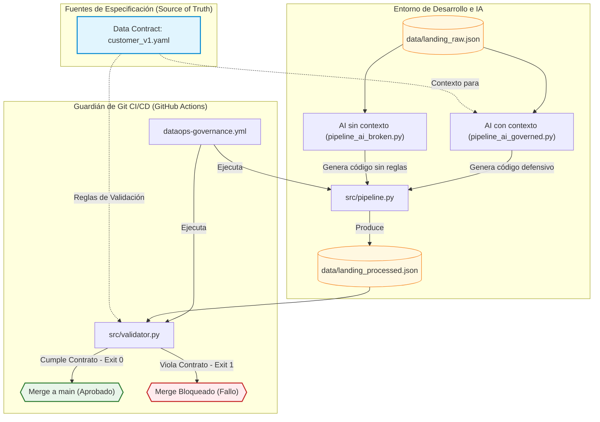
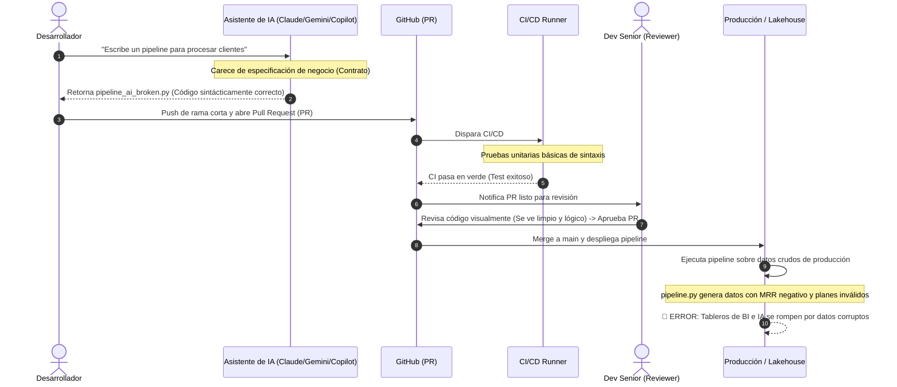
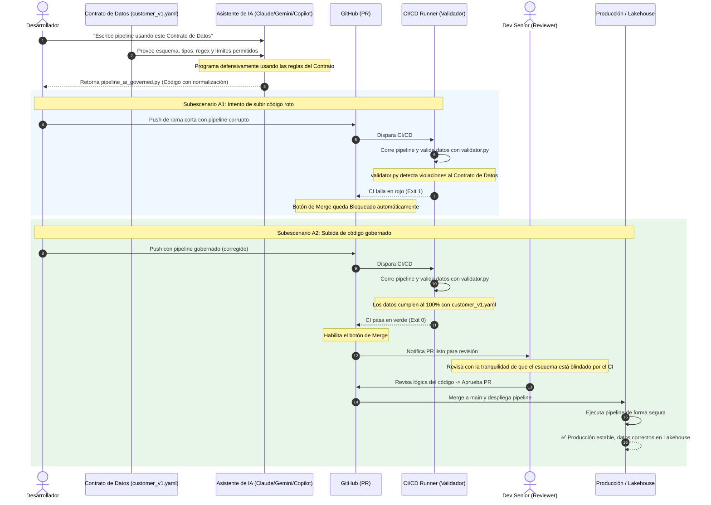

# 📚 Demo de Gobernanza de IA con Data Contracts
### Curso: Contract-Driven DataOps con Git e IA

Esta guía está diseñada para que el instructor realice una **demostración interactiva en vivo (Live Demo)** sobre cómo un esquema de gobernanza basado en **Git** y **Data Contracts** (Contratos de Datos) actúa como un escudo protector cuando delegamos la creación de pipelines a **Agentes de IA** (como Cursor, Copilot o Devin).

---

## 🎯 Objetivos de Aprendizaje
Al finalizar esta demostración, los alumnos comprenderán:
1. **El peligro de la IA sin control:** Cómo los copilotos pueden generar código sintácticamente correcto pero que viola reglas de negocio silenciosamente.
2. **El paradigma Contract-First:** Cómo el contrato de datos en YAML sirve de "especificación de verdad" tanto para los humanos como para la IA.
3. **El rol del CI/CD de Git:** Cómo Git se convierte en el guardián definitivo que bloquea integraciones defectuosas de código generado por IA antes de que toquen producción.

---

## 🗺️ Diagrama de Arquitectura y Flujo

El siguiente diagrama de Mermaid muestra cómo fluye la especificación del contrato de datos a través de las fases de desarrollo (guiadas por IA), generación del pipeline y validación defensiva en el CI/CD antes de permitir el merge a producción:



---

## 🔄 Diagramas de Secuencia: Flujo de Trabajo (Caos vs. Gobierno)

Para comprender mejor cómo interactúan el desarrollador (asistido por IA), GitHub, el CI/CD, el Dev Senior y el Lakehouse, a continuación se presentan los diagramas de secuencia para ambos escenarios.

### Escenario A: Flujo Tradicional sin Gobierno (El Caos)
En este flujo, al no haber una validación automatizada contra un contrato de datos en el CI/CD, el código generado por IA con errores silenciosos de lógica es aprobado y llega a producción, rompiendo los tableros analíticos.



---

### Escenario B: Flujo Spec-Driven con Gobierno (DataOps Seguro)
En este flujo, el Contrato de Datos es consumido por la IA para escribir código defensivo. Si el desarrollador o la IA intentan subir un pipeline incorrecto, el CI/CD ejecuta la validación dinámica del validador y bloquea automáticamente el Pull Request. Cuando se sube la solución conforme al contrato, el CI/CD aprueba y el Dev Senior puede realizar el merge con total tranquilidad.



---

## 🛠️ Estructura del Sandbox

El sandbox del repositorio simula un entorno de producción real:
```markdown
.github/workflows/
└── dataops-governance.yml   # Guardián del PR en GitHub Actions
contracts/
└── customer_v1.yaml         # El Contrato de Datos (la fuente de verdad)
data/
├── landing_raw.json         # Datos crudos de origen (ingesta)
└── landing_processed.json   # Datos procesados por el pipeline (output)
src/
├── validator.py             # Validador oficial del contrato
├── pipeline_ai_broken.py    # Simulación: Pipeline generado por IA sin contexto
└── pipeline_ai_governed.py  # Simulación: Pipeline generado por IA con contexto
```

---

## 🚀 Preparación del Entorno (15 minutos antes de la clase)

1. Asegúrate de tener instalado PyYAML en el entorno de Python:
   ```bash
   pip install pyyaml
   ```
2. Posiciónate en la terminal en la carpeta raíz de este repositorio.

---

## 🎭 La Demostración en 3 Actos

### Acto 1: La IA sin Control (El desastre silencioso)

#### 💻 Acción en pantalla
1. Simula que la IA escribe el pipeline principal copiando el script roto:
   ```bash
   cp src/pipeline_ai_broken.py src/pipeline.py
   ```
2. Ejecuta el pipeline para simular el procesamiento de datos:
   ```bash
   python src/pipeline.py
   ```
   *Salida esperada:*
   ```text
   🚀 Iniciando procesamiento del pipeline (AI Ungoverned)...
   ✅ Pipeline finalizado. Resultados guardados en: .../data/landing_processed.json
   ```
3. **El momento de la verdad:** Corre el validador contra el archivo generado:
   ```bash
   python src/validator.py data/landing_processed.json
   ```
   *Salida esperada:*
   ```text
   🚨 INCUMPLIMIENTO DE CONTRATO DETECTADO EN: data/landing_processed.json
      - Fila 2: 'subscription_plan' tiene un valor no permitido. Recibido: 'basic'
      - Fila 3: 'mrr_value' viola el mínimo de 0.0. Recibido: -15.0
   ```
4. **Conclusión del Acto 1:** 

Si este script de la IA se intentara integrar a la rama principal, el CI/CD configurado en `.github/workflows/dataops-governance.yml` detectaría el código de salida `1` del validador y **bloquearía automáticamente el Pull Request**, salvando al Lakehouse de corromperse.

---

### Acto 2: La IA Gobernada por el Contrato (El éxito)

#### 💻 Acción en pantalla
1. Simula que la IA escribe el pipeline correcto guiada por la spec:
   ```bash
   cp src/pipeline_ai_governed.py src/pipeline.py
   ```
2. Ejecuta el nuevo pipeline gobernado:
   ```bash
   python src/pipeline.py
   ```
   *Salida esperada:*
   ```text
   🚀 Iniciando procesamiento del pipeline (AI Governed)...
   ⚠️ Plan 'basic' no permitido. Mapeando a 'free' según especificación.
   ⚠️ MRR negativo detectado (-15.0). Ajustando a 0.0 para cumplir el contrato.
   ✅ Pipeline finalizado. Resultados guardados en: .../data/landing_processed.json
   ```
3. Corre el validador oficial nuevamente:
   ```bash
   python src/validator.py data/landing_processed.json
   ```
   *Salida esperada:*
   ```text
   ✅ data/landing_processed.json cumple 100% con la especificación 'customer_gold'.
   ```
4. **Conclusión del Acto 2:** La IA fue capaz de corregir los tipos y mapear planes inválidos gracias a la guía del contrato. El validador retorna `exit 0` y Git permite el despliegue automático a producción.

---

### Acto 3: Evolución del Contrato y Bloqueo en Tiempo Real

#### 💻 Acción en pantalla
1. Edita el contrato de datos `contracts/customer_v1.yaml` para añadir un nuevo campo requerido. Puedes usar tu editor o reemplazar el contenido del archivo agregando estas líneas al final:
   ```yaml
     email:
       type: string
       required: true
       pattern: "^[a-zA-Z0-9._%+-]+@[a-zA-Z0-9.-]+\\.[a-zA-Z]{2,}$"
   ```
2. Corre el validador sobre los datos procesados actuales:
   ```bash
   python src/validator.py data/landing_processed.json
   ```
   *Salida esperada:*
   ```text
   🚨 INCUMPLIMIENTO DE CONTRATO DETECTADO EN: data/landing_processed.json
      - Fila 0: Campo requerido 'email' ausente.
      - Fila 1: Campo requerido 'email' ausente.
      - ...
   ```
3. Pídele en vivo a Claude/Gemini/Copilot (o simula la corrección en `src/pipeline.py` agregando un correo dummy a partir de los datos crudos, por ejemplo `f"usr-{record['id']}@fintechpay.com"`) para demostrar cómo la IA adapta el código basándose en el error del validador y el nuevo YAML.
s guardados en: .../data/landing_processed.json
   ```
3. Corre el validador oficial nuevamente:
   ```bash
   python src/validator.py data/landing_processed.json
   ```
   *Salida esperada:*
   ```text
   ✅ data/landing_processed.json cumple 100% con la especificación 'customer_gold'.
   ```
4. **Conclusión del Acto 2:** La IA fue capaz de corregir los tipos y mapear planes inválidos gracias a la guía del contrato. El validador retorna `exit 0` y Git permite el despliegue automático a producción.

---

### Acto 3: Evolución del Contrato y Bloqueo en Tiempo Real

#### 📝 Narración
> *"Los negocios evolucionan. Supongamos que agregamos un nuevo campo obligatorio en el contrato de datos, por ejemplo, el correo electrónico (`email`) del cliente. Veremos cómo nuestro validador rompe el flujo inmediatamente, obligándonos a actualizar el pipeline."*

#### 💻 Acción en pantalla
1. Edita el contrato de datos `contracts/customer_v1.yaml` para añadir un nuevo campo requerido. Puedes usar tu editor o reemplazar el contenido del archivo agregando estas líneas al final:
   ```yaml
     email:
       type: string
       required: true
       pattern: "^[a-zA-Z0-9._%+-]+@[a-zA-Z0-9.-]+\\.[a-zA-Z]{2,}$"
   ```
2. Corre el validador sobre los datos procesados actuales:
   ```bash
   python src/validator.py data/landing_processed.json
   ```
   *Salida esperada:*
   ```text
   🚨 INCUMPLIMIENTO DE CONTRATO DETECTADO EN: data/landing_processed.json
      - Fila 0: Campo requerido 'email' ausente.
      - Fila 1: Campo requerido 'email' ausente.
      - ...
   ```
3. Pídele en vivo a Cursor/Copilot (o simula la corrección en `src/pipeline.py` agregando un correo dummy a partir de los datos crudos, por ejemplo `f"usr-{record['id']}@fintechpay.com"`) para demostrar cómo la IA adapta el código basándose en el error del validador y el nuevo YAML.

---

## 💡 Preguntas para Debatir con la Clase
* ¿Por qué es más eficiente validar en el CI/CD en lugar de validar únicamente cuando los datos ya entraron al Data Lake?
* Si un desarrollador junior o una IA decide cambiar un tipo de dato en la base de datos origen sin avisar, ¿cómo nos protege este flujo?
* ¿Qué rol juega Trunk-Based Development en permitir que el código corregido por la IA llegue rápido a producción sin crear conflictos de merge?
